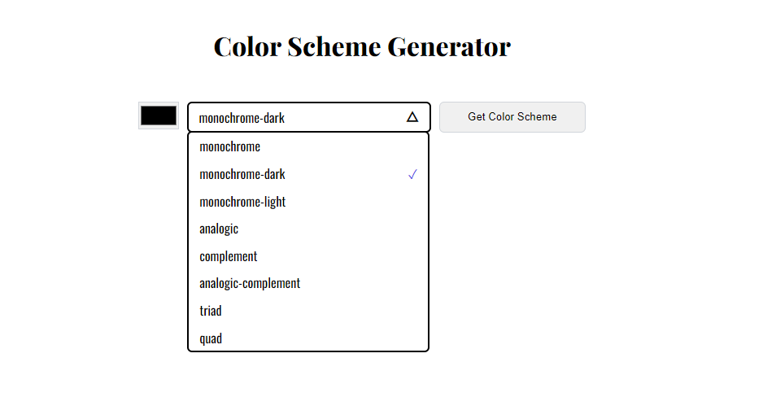
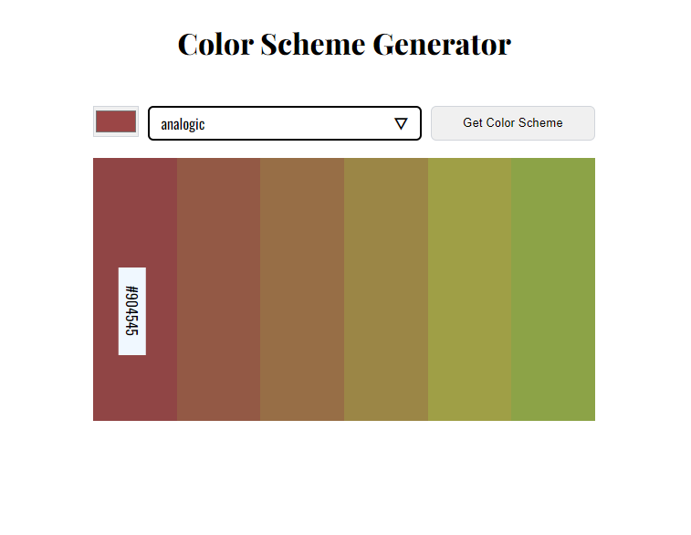

# Color Scheme Generator

## Table of Contents

-   [**Overview**](#overview)
-   [**Usage**](#usage)
-   [**File Structure**](#file-structure)
-   [**Contributions**](#contributions)

## Overview

The Color Scheme Generator is a tool tailored for developers seeking harmonious color combinations for their projects. Leveraging the colorAPI service, it empowers users to select a base color and receive a curated collection of complementary colors adhering to predefined color schemes. Notably, the application boasts a distinctive custom select menu meticulously crafted for this project, enhancing both functionality and aesthetics.

## Usage

To begin, access the live URL of the project. Upon arrival, you will encounter the initial screen, prompting you as follows:

Proceed by clicking the color picker to designate a base color. Subsequently, navigate through the custom select menu to choose your desired color scheme, as demonstrated below:

Lastly, click the "Get color scheme" button to unveil the array of colors associated with the selected scheme. Hovering over each color bar reveals its corresponding hex code, facilitating easy copying to the clipboard, as illustrated here:

## File Structure

-   index.html: Primary markup for the project and entry point for dynamically generated content.
-   css: Directory housing CSS files responsible for styling.
-   main.js: Logic for API calls and various interactive elements.
-   select-menu.js: JavaScript module dedicated to crafting the custom select menu.

## Contributions

Contributions are warmly welcomed. Feel free to reach out if you're interested in collaborating on further enhancements or new features. Let's create something great together!
